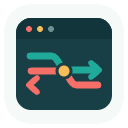
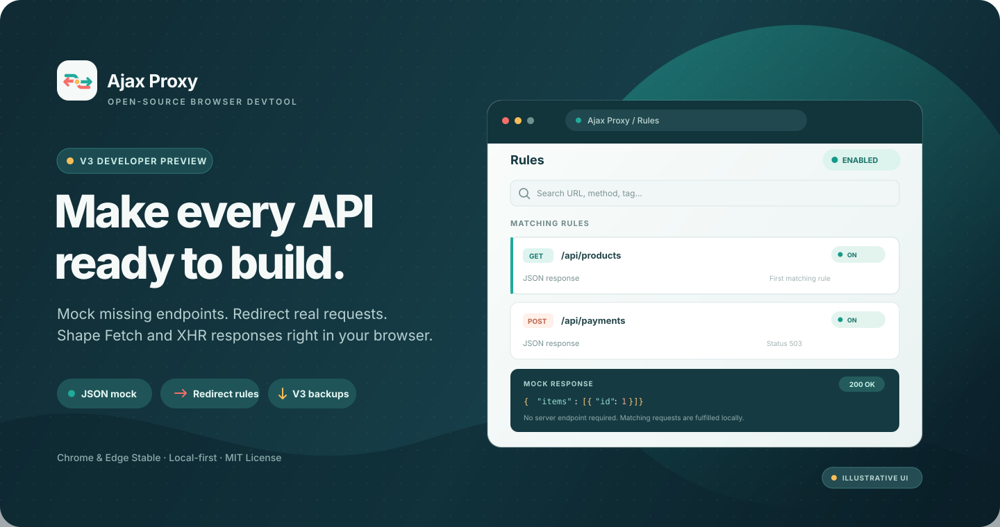

<div align="center">
  
  <h1>Ajax Proxy</h1>
  <p><strong>按你的需要改写接口响应，让开发继续向前。</strong></p>
  <p>在 Chromium 浏览器中 Mock 尚不存在的接口、重定向请求，并随时验证边界场景。</p>

  <p>
    <a href="https://github.com/Nyakooo/ajax-proxy/actions/workflows/ci.yml?query=branch%3Amaster"></a>
    <a href="LICENSE"></a>
    <a href="https://github.com/Nyakooo/ajax-proxy/stargazers"></a>
    <a href="https://chrome.google.com/webstore/detail/ajax-proxy/jbikjaejnjfbloojafllmdiknfndgljo"></a>
    <a href="https://microsoftedge.microsoft.com/addons/detail/ajax-proxy/iladajdkobpmadjfpeginhngnneaoefi"></a>
  </p>

  <p><strong>V3.0.0 正式版本 · Chrome 与 Microsoft Edge 稳定版</strong><br>Mock 尚不存在的接口、重定向请求，并在浏览器中调整支持的 Fetch 与 XHR 响应。</p>
  <p><a href="https://github.com/Nyakooo/ajax-proxy/releases/tag/v3.0.0"><strong>下载 Ajax Proxy 3.0.0</strong></a> · <a href="https://chrome.google.com/webstore/detail/ajax-proxy/jbikjaejnjfbloojafllmdiknfndgljo">Chrome 网上应用店</a> · <a href="https://microsoftedge.microsoft.com/addons/detail/ajax-proxy/iladajdkobpmadjfpeginhngnneaoefi">Edge 加载项</a></p>
  <p>
    <a href="#安装-v3-300"><strong>安装 V3.0.0</strong></a> ·
    <a href="docs/V3-RULE-MODEL.zh.md">规则模型</a> ·
    <a href="docs/V3-BACKUP-RESTORE.zh.md">备份与恢复</a> ·
    <a href="https://github.com/Nyakooo/ajax-proxy/issues">问题反馈</a>
  </p>
  <p><a href="README.md">English</a> | 简体中文</p>
</div>

<p align="center">
  
</p>

## 为什么使用 Ajax Proxy？

前端页面需要的接口可能还没开发好，也可能很难稳定复现某个错误。Ajax Proxy 可以在浏览器里直接为请求配置响应，不必改业务代码，也不用等待后端准备测试数据，就能继续联调和验证界面。

## 核心能力

- **Mock 接口响应：** 按 URL 和请求方法匹配，为 Fetch 或支持的异步 XHR 返回指定的 JSON 内容与状态码。浏览器请求由扩展直接提供响应，不要求服务端真的存在这个接口。
- **重定向请求：** 将匹配到的请求发送到另一个 URL；静态重定向可设置请求头或排除指定 URL，也可用受限函数为 Fetch 动态计算目标地址。
- **覆盖异常场景：** 按需模拟空数据、校验失败、错误状态码及其他难以触发的响应场景。
- **就地管理规则：** 搜索和筛选规则、置顶重要规则、用标签归类，并快速切换扩展总开关或当前站点规则。多条规则同时匹配时，按列表顺序仅应用首条启用规则。
- **查看已确认的执行结果：** 按需开启临时诊断，查看规则动作已应用、回退、失败或暂不支持等状态。
- **按需使用函数规则：** V3 支持在受限 sandbox 中计算 JSON 响应和重定向目标。函数规则只作用于 Fetch；XHR 保留原始响应或 URL。
- **备份和恢复 V3 配置：** 导出独立的 V3 配置备份，便于迁移或重置浏览器配置文件。

Ajax Proxy 以浏览器扩展形式运行，不需要 Ajax Proxy 账号或托管服务。V3 当前最低支持 Chrome 141、Microsoft Edge 140 稳定版；支持窗口策略见[浏览器兼容说明](docs/V3-BROWSER-COMPATIBILITY.zh.md)。

### 快速创建一个 Mock 接口

1. 点击扩展图标，在 popup 中打开**大面板**，选择**创建规则**。
2. 填写要匹配的 URL（可用 URL 片段）和请求方法；保持 `ANY` 可匹配任意方法。
3. 在响应规则中选择静态 JSON 响应，将**响应行为**设为**Mock：跳过真实请求**，填写状态码和 JSON 内容，然后保存并启用规则。
4. 确认扩展总开关及当前站点规则已开启，再从页面发起匹配请求。Fetch 和支持的异步 XHR 会直接收到配置的响应；真实请求不会发送。

Mock 命中会在面板中标记“Mock 已跳过真实网络请求”，并显示返回状态码。它适用于接口尚不存在或需要固定响应的场景。若选择普通响应替换，扩展会先发送真实请求再替换返回值；函数响应也需要真实响应作为输入。函数响应目前只用于 Fetch。

## 安装 V3 3.0.0

> **升级提示：** V2 与 V3 的规则和备份格式互不兼容，V3 不会自动迁移旧数据。升级前请导出并另存 V2 备份，再在 V3 中按需重新创建规则。

从 [V3.0.0 GitHub Release](https://github.com/Nyakooo/ajax-proxy/releases/tag/v3.0.0) 下载 `ajax-proxy-3.0.0.zip` 并解压，然后在 Chrome（`chrome://extensions`）或 Edge（`edge://extensions`）中：

1. 开启**开发者模式**。
2. 选择**加载已解压的扩展程序**。
3. 选择包含 `manifest.json` 的解压目录。
4. 打开扩展 popup，点击**打开大面板**管理规则。

从源码构建需要 Node.js `>=24.21.0 <25` 和 pnpm `12.6`：

```sh
git clone https://github.com/Nyakooo/ajax-proxy.git
cd ajax-proxy
pnpm install --frozen-lockfile
pnpm build
```

生产构建位于 `packages/shell-chrome/build`。V3.0.0 已在 Chrome 与 Microsoft Edge 稳定版完成核心功能验收；详见[面板迁移说明](docs/V3-PANEL-MIGRATION.zh.md)、[浏览器兼容范围](docs/V3-BROWSER-COMPATIBILITY.zh.md)与[测试和验收记录](docs/V3-TESTING.zh.md)。扩展商店的更新可能需要等待平台审核。

## 文档

- [V3 规则模型与命中优先级](docs/V3-RULE-MODEL.zh.md)
- [V3 配置备份与恢复](docs/V3-BACKUP-RESTORE.zh.md)
- [V3 迁移状态与已知差异](docs/V3-PANEL-MIGRATION.zh.md)
- [V3 浏览器兼容范围](docs/V3-BROWSER-COMPATIBILITY.zh.md)
- [Ajax Proxy Playground](docs/PLAYGROUND.zh.md)
- [自定义响应函数与 sandbox 限制](docs/V3-USER-FUNCTIONS.zh.md)
- [权限和安全边界](docs/V3-PERMISSIONS.zh.md)
- [更新日志](CHANGELOG.zh.md) · [Changelog in English](CHANGELOG.md)
- [V2 旧函数 API 参考（不适用于 V3）](README.func.md)

上方 Chrome 与 Edge 链接指向现有商店条目；商店审核期间，商店可用版本可能晚于 GitHub Release。

## 在线 Playground

打开 [Ajax Proxy Playground](https://nyakooo.github.io/ajax-proxy/playground/)，可在真实浏览器页面中测试 Fetch、XHR、iframe、srcdoc、Worker 对照及其他请求场景。每次点击后，页面会实时显示最新请求的 URL、状态和实际响应体，并保留请求历史，便于直接判断规则是否生效。

建议先创建一条启用的 GET 规则，匹配 `playground/fixtures/profile.json`，并将响应体改成容易辨认的内容；然后在 Playground 点击 **发送 Fetch GET** 或 **发送 XHR JSON**，对照页面响应和扩展面板中的命中计数。Worker 场景仅作原生请求对照，当前不支持拦截 Dedicated Worker 内的请求。完整场景说明、规则配置示例和本地启动方法见 [Playground 测试指南](docs/PLAYGROUND.zh.md)。

## 演示

下面的动图展示的是**旧版 V2 界面**，仅作历史演示；它不是 V3.0.0 的界面截图。

<details>
  <summary>展开查看 V2 旧版演示</summary>
  <p><a href="https://www.bilibili.com/video/BV1KB4y1j7Gm">观看 Bilibili 上的旧版功能演示</a>。</p>
  <p></p>
</details>

## 参与贡献

欢迎通过 [GitHub Issues](https://github.com/Nyakooo/ajax-proxy/issues) 反馈问题或提出功能建议。请提供浏览器和扩展版本及最小复现步骤；分享日志或备份前，请移除真实请求内容、Cookie、令牌、个人信息和私有函数代码。较大的改动建议先通过 issue 讨论范围；提交 PR 时请聚焦单一主题，并说明用户可见变化和已完成的功能验证。默认分支为 `master`。

## 许可证

Ajax Proxy 使用 [MIT License](LICENSE) 开源。
