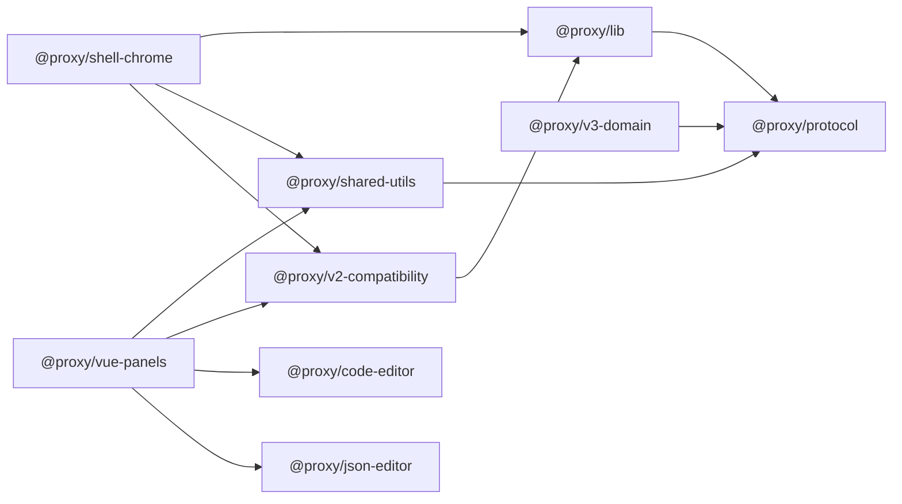
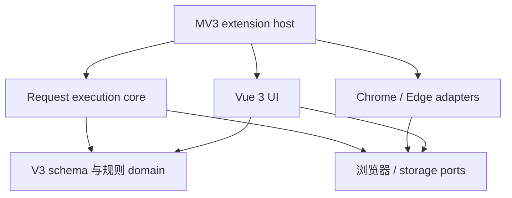
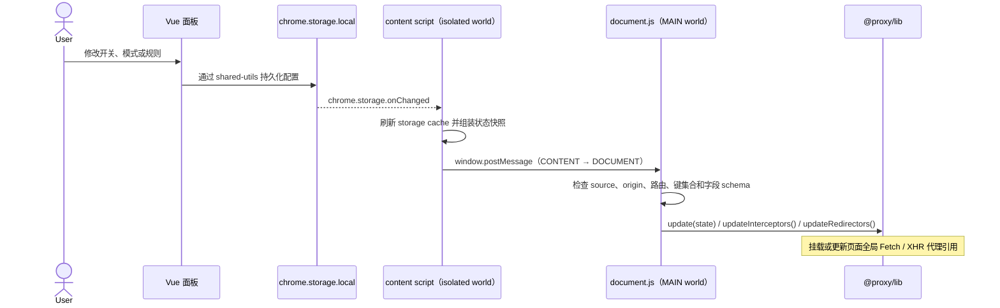
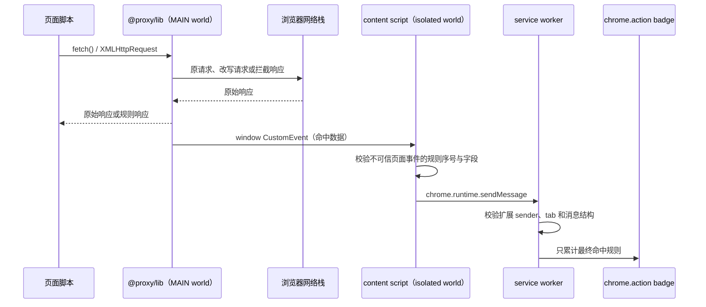

# V3 目录结构与包边界评估

盘点日期：2026-09-25。本文记录阶段 0 的架构评估与迁移建议，并在阶段 2 补充当前包依赖和运行链路；V3 明确不迁移 V2 配置，因此历史格式转换实现不应自然地延续为 V3 的核心依赖。

## 当前包与依赖方向

以下箭头表示左侧包依赖右侧包，依据各包 `package.json` 的 workspace dependencies。图含当前全部 9 个 workspace 包；外部 npm dependencies 不展开。`@proxy/v3-domain` 已建立并依赖 protocol，但运行时接入仍是后续工作。

`@proxy/protocol` 是不依赖其他 workspace 包的协议基础包，导出消息和 storage key 常量；shared-utils 重导出这些常量，proxy-lib 依赖它发出命中事件。`@proxy/v2-compatibility` 依赖 `@proxy/lib` 的公开类型入口；shell 和 panels 保留现存 V2 路径，panels 另行使用 shared-utils 与两个 Vue 2 编辑器包。

目标依赖方向建议如下。箭头表示左侧模块依赖右侧模块；按 `V3 domain / platform ports → request engine / adapters / UI → extension host` 拓扑排序，无循环。此图是迁移目标，需在边界落地后通过 clean build 和 package-only build 验证。

| 当前包 / 区域                                               | 当前职责                                                                                                               | V3 建议                                                                                                           |
| ----------------------------------------------------------- | ---------------------------------------------------------------------------------------------------------------------- | ----------------------------------------------------------------------------------------------------------------- |
| `protocol`                                                  | 现为 `@proxy/protocol`，只导出浏览器无关的消息 / storage key 常量                                                      | 保持为稳定叶子包；禁止依赖 Vue、Chrome API、storage 实现和业务包                                                  |
| `shared-utils`                                              | Chrome 环境判断、storage、消息通知、badge 操作混在一个包                                                               | 按平台适配与存储职责继续拆分；核心规则不得依赖 UI 或 Chrome API                                                   |
| `proxy-lib`                                                 | Fetch / XHR 拦截、重定向、函数执行、规则匹配                                                                           | 按 rule domain、请求执行策略和浏览器拦截 adapter 拆内部 feature；只有定义和 adapter 接口通过公共入口暴露          |
| `v3-domain`                                                 | `@proxy/v3-domain`，纯 V3 backup envelope / 规则 schema 与 JSON 校验、V2 格式识别                                      | 扩展为浏览器无关的 V3 规则领域；不依赖扩展宿主、Vue 或 V2 转换                                                    |
| `v2-compatibility`                                          | V2 字段与现有配置结构转换，类型依赖 proxy-lib；当前由 shell 启动和面板导入路径运行时调用                               | 该包是 V2 现存路径的真实依赖；迁移期间隔离其职责，V3 用版本识别 / 拒绝提示替代，不把转换能力带入新 schema         |
| `shell-chrome`                                              | content script、document script、service worker、manifest 和 Webpack 打包                                              | 保留为 Chrome/Edge MV3 平台入口；service worker、content script、消息处理按运行上下文明确拆分                     |
| `vue-panels`                                                | Vue 2 UI、store、通知、语言及规则业务视图                                                                              | 迁移到 Vue 3 后按 feature 拆分规则编辑、设置、导入导出和反馈；把 Chrome storage 调用改走 adapter                  |
| `code-editor` / `json-editor`                               | 两个独立 Vue 2 组件包，分别打包并由 panels 静态导入                                                                    | 先做编辑器 API 与体积评估；最终 UI 可保留单一编辑器 adapter，但按需载入代码与语言包，结构化 JSON 编辑能力不得退化 |
| `packages/*/types`                                          | TypeScript 声明由源码生成、随源码提交；build 会清空并重建                                                              | 继续作为声明构建产物并提交；CI 在 build 后检查声明与源码同步，clean checkout 可按 workspace 依赖顺序重建          |
| `packages/*/{lib,build,dist}`                               | 包级构建产物；根 `.gitignore` 忽略同名目录                                                                             | 继续排除生产产物的手工维护；由 CI / release 从干净源码可重复生成                                                  |
| `packages/proxy-lib/test` 与根 `Interceptor.test.json`      | 手工 HTML fixture 和 V3 单测混放                                                                                       | 源码单测就近放 `test/`；多包集成和 Playwright 场景放根 `tests/`，fixture 与目的相邻并注明清理 / 使用方式          |
| `packages/vue-panels/src/{app,infrastructure,shared,views}` | 原 common 目录职责混杂；现按 app plugin、storage / notice adapter、纯 UI helper、interceptor / redirector feature 拆分 | 继续围绕 feature 组织规则 UI；跨 feature helper 保持少量、纯函数和清楚的业务 / UI 职责                            |

## 当前包入口与构建产物

| 包                                         | 代码入口 / 类型入口                                                                | 构建产物与消费方式                                                                                              |
| ------------------------------------------ | ---------------------------------------------------------------------------------- | --------------------------------------------------------------------------------------------------------------- |
| `@proxy/protocol`                          | `main: lib/index.js`；`types: types/index.d.ts`                                    | 纯 TypeScript 协议叶子包；为 shared-utils 和 proxy-lib 提供可复用常量，不引用平台 API。                         |
| `@proxy/shared-utils`                      | `main: lib/index.js`；`types: types/index.d.ts`                                    | `tsc` 同步生成 `lib/` 和 `types/`；依赖并重导出 protocol，由扩展宿主与 Vue 面板通过根入口消费。                 |
| `@proxy/lib`                               | `main: lib/index.umd.js`、`module: lib/index.esm.js`、`typings: types/index.d.ts`  | TypeScript 声明 + Vite UMD / ESM；extension host 打包运行时入口，兼容包仅从根入口导入公开类型。                 |
| `@proxy/v2-compatibility`                  | `main: lib/index.js`、`types: types/index.d.ts`                                    | `tsc` 生成 CommonJS 与声明；由 shell 初始化和面板旧数据导入路径消费，V3 不应依赖此转换器。                      |
| `@proxy/shell-chrome`                      | Webpack 多入口：`src/content.ts`、`src/document.ts`、`src/service-worker/index.ts` | 生成 `build/` 扩展目录并复制 manifest / 图标；`package.json` 过去的 `main: index.js` 指向不存在文件，现已移除。 |
| `@proxy/vue-panels`                        | Vue CLI `src/main.js` / `src/App.vue`                                              | 生成 `dist/` 静态面板，再由根 `pkg` 脚本复制到 `shell-chrome/build/panels`。                                    |
| `@proxy/code-editor`、`@proxy/json-editor` | Vue CLI library 的 `packages/index.js`，CommonJS `main: lib/index.common.js`       | 私有 workspace 组件，生成 JS 和 CSS 到 `lib/`；CSS 由面板作为静态资源子路径导入，不建立 JS 深层源码依赖。       |

`lib/`、`build/`、`dist/` 都是忽略的构建输出。`types/**/*.d.ts` 是 TypeScript 从源码生成、随源码提交的包声明快照：workspace 的类型检查早于生产构建运行，因此 clean checkout 需要已有声明；CI 构建后执行 `pnpm check:generated-types`，确保生成文件与提交源码一致。面板和编辑器没有独立声明入口，因其只作为私有 workspace 应用 / Vue 组件，不作为 TS SDK 发布。

## 结构与可重建风险

- 运行职责层面已有可识别顶层包，但 `compatibility` 是以旧配置格式命名的横切包，V3 边界尚不合适。
- UI 面板内部主要按页面的 `interceptor`、`redirector` 划分，状态、Chrome 消息、storage 和编辑器依赖跨层；`common` 名称无法表达依赖方向。
- `@proxy/v2-compatibility` 过去从 `@proxy/lib/types/types` 深层路径引用内部类型，绕过包入口；现已改为从 `@proxy/lib` 读取公开类型，`proxy-lib` 根入口导出 compatibility 使用的类型。clean build 已确认声明生成按 workspace 依赖顺序成功。
- `pnpm check:boundaries` 检查 workspace manifest 依赖无环、跨包导入已声明且不绕过公开入口；唯一深层资源例外是 Vue 面板静态导入 JSON 编辑器生成的 CSS。该检查已纳入 CI。
- `.gitignore` 忽略根下所有同名 `lib`、`build`、`dist` 目录，但 `types/*.d.ts` 受跟踪；已决定它们是由源码生成且随源码提交的声明快照，并由 `pnpm check:generated-types` 阻止 CI 产出漂移。
- 编辑器是独立 workspace package，却静态进入面板主 JS；结构上的分包没有实现首屏异步加载收益。需以后续构建产物和编辑器交互原型验收。
- workspace glob 当前是 `packages/**`，跨包 browser smoke / extension E2E 已归入根 `tests/browser/`；包内单测就近放置，测试 / fixture 的生命周期见 `docs/V3-TESTING.zh.md`。

## 推荐迁移顺序

1. 建立依赖图、公共入口和 clean checkout 产物策略；为每个 package 增加独立 build / typecheck 验收。
2. 把 V3 schema、规则定义、导入校验与纯规则选择放入独立的 domain package；不让它导入 Chrome、Vue 或旧 compatibility。
3. 明确浏览器平台 adapter 与 core 的窄接口，将 storage、通知和请求上下文注入到执行引擎。
4. 在确认所有旧格式调用点之后移除或收缩 `compatibility`；V3 importer 只辨认并拒绝 V2，不做字段转换。
5. 随 Vue 3 UI 一起按 feature 整理 panels 内部目录；迁移一个 feature 即保持构建、类型与关键测试通过。
6. 最后按编辑器比较结果拆分异步 chunk，并将单元、集成、浏览器测试移到各自稳定位置。

## 风险与验收

- 风险：过早拆包会放大 Vite 2、Vue CLI / Webpack、workspace package exports 和声明路径之间的耦合。每次迁移必须用全量与 package-only clean build 验证。
- 已确认：`compatibility` 不只用于面板导入，也被 shell 的启动路径调用；现已迁至 `packages/v2-compatibility` 并改名为 `@proxy/v2-compatibility`，保留现有 V2 路径。V3 importer 仍须独立实现版本识别 / 拒绝提示。
- 风险：把 storage 和消息通知搬入 core 会带入浏览器副作用；依赖方向检查应阻止此类反向依赖。
- 验收：dependency graph 无环；core/domain 不依赖 UI、Chrome API 或 V2 converter；包入口及声明所有权明确；干净 checkout 能按文档构建、类型检查和运行测试；产物无需预先存在于工作树；测试与 fixture 的归属有清楚说明。

阶段 1 已落实协议叶子包、兼容包命名、面板 common 职责拆分和依赖边界检查。更深入的 V3 domain 拆分、Chrome adapter 与 UI 间窄接口仍按本文建议留在阶段 2 逐项执行。

2026-09-25 对当前工作区执行 `pnpm clean:build` 后再运行完整 `pnpm build`，随后 `pnpm typecheck`、`pnpm test`、`pnpm lint`、`pnpm format:check` 和 ZIP / 体积报告均通过。此验证确认现有 workspace build 顺序可从删除的 shared-utils、proxy-lib 和 shell-chrome 输出恢复；它没有构建尚未实现的目标包图，目标边界仍需在迁移中逐项验证。

更新（2026-09-25）：浏览器运行时与扩展 E2E 脚本已归入根 `tests/browser/`；扩展 smoke 使用临时浏览器 profile 加载实际构建产物。Chrome Stable / Edge Stable 当前版扩展 Fetch / XHR 和 Chrome 141 最低版扩展流程已验证；Edge 140 Linux 品牌浏览器 smoke 已加入 CI 矩阵，待远端首次运行。8 个 workspace package 依赖无环，Node 24.21.0 下全包 clean build、类型检查和扩展 E2E 已通过。这个包图用于梳理 V2 工程边界，不表示完整的 V3 domain package 已创建。

更新（2026-09-25）：`pnpm clean:build` 扩大到清理编辑器库与面板 dist。干净构建复现 Vue CLI 私有编辑器包并行输出多格式时的 CSS 文件写入竞争；两个包改为只输出其 `main` 声明使用的 CommonJS 格式后，Node 24.21.0 clean build 与扩展 E2E 均通过。

更新（2026-09-25）：兼容性包已停止引用 `@proxy/lib/types/types` 私有声明路径，改由 `@proxy/lib` 公共入口导入；代理库根入口补齐所需公共类型。新增 `@proxy/protocol` 叶子包，将纯消息 / storage key 常量从 shared-utils 解耦；请求核心不再依赖包含 Chrome storage / badge 的工具包。`pnpm check:boundaries` 检查 8 个 workspace 包依赖无环、包间导入有 manifest 声明、阻止 core 依赖 UI / 浏览器适配包并避免源码深层路径，CI 已运行；全包 clean build 和 typecheck 通过。声明文件提交并由 CI 构建后校验漂移。阶段 1 验收结束，V3 领域包拆分继续列于阶段 2。

## 阶段 2 当前运行链路

### 面板配置同步到页面代理

页面启动时，content script 先初始化 storage 并读取配置，再将当前快照同步到 document.js；V2 的首次安装转换仍属于现存兼容路径。面板初始化前等待 shared-utils storage 初始化。`window.postMessage` 同页内容可被网页脚本伪造，因此主世界接收端必须持续按不可信输入验证，不能用它做扩展权限或持久化授权。

### 页面请求与命中统计

命中事件从页面主世界发出，页面自身可以伪造同页事件；content script 和 service worker 均校验结构，service worker 另核对扩展 ID 与 tab sender。系统把该通道限于本页代理状态和命中展示。

更新（2026-09-25）：阶段 2 补充当前架构图和两条运行链路。依赖图按 9 个 workspace manifest 核对，并由 `pnpm check:boundaries` 确认无环；配置同步、页面代理、命中事件和 service worker sender 校验依据 `content.ts`、`document.ts`、`proxy-lib/src/index.ts` 与 `service-worker/index.ts` 核对。图表示当前实现；`@proxy/v3-domain` 尚未接入请求运行时。
