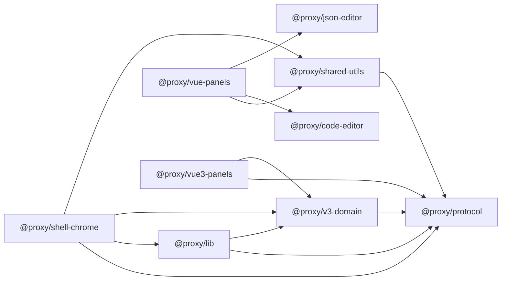
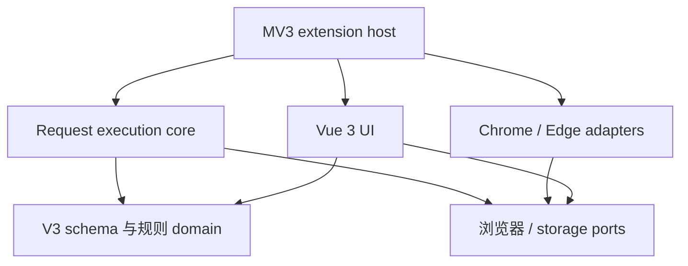
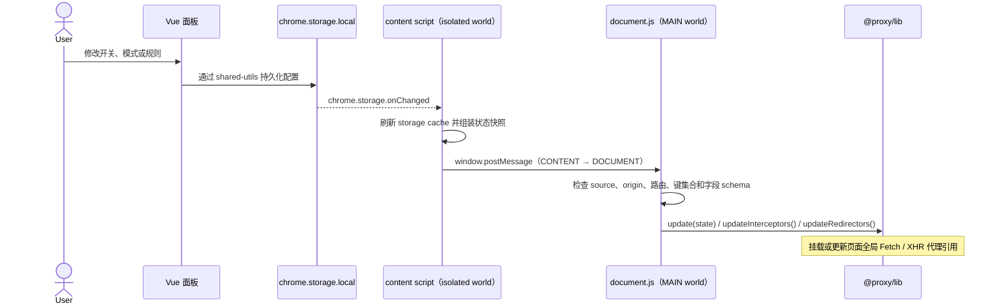
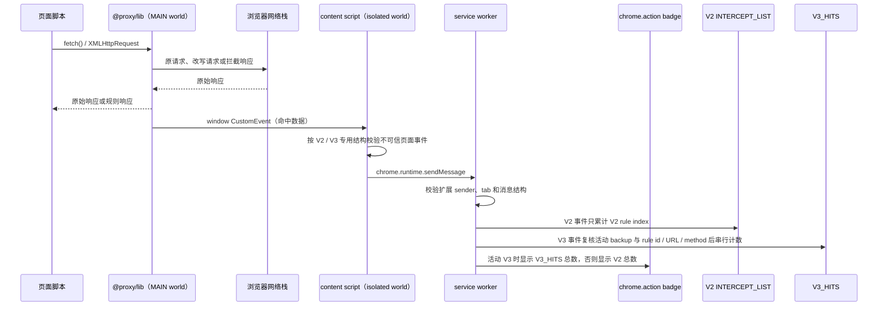

# V3 目录结构与包边界评估

初次评估日期：2026-09-25；状态更新：2026-09-28。V3 不兼容 V2 配置，自动数据转换和 `@proxy/v2-compatibility` 已退役。正式构建与 CI 使用 Vite 和 Vue 3 面板；Vue 2 面板及其编辑器作为历史源码留在 workspace，不再进入正式构建或浏览器验收。V2 runtime 源码尚未整体退役。

## 当前包与依赖方向

以下箭头表示左侧包依赖右侧包，依据各包 `package.json` 的 workspace dependencies。图含当前 9 个 workspace 包；外部 npm dependencies 不展开。`@proxy/protocol` 提供浏览器无关的消息 / storage key 常量和 V3 命中消息契约；`@proxy/v3-domain` 提供 schema 校验和纯规则选择；`@proxy/lib` 提供 Fetch / XHR runtime，`@proxy/shell-chrome` 将 V3 配置接入该 runtime 并独立路由命中统计。正式面板使用 V3 规则 UI。

```mermaid
flowchart LR
  protocol["@proxy/protocol"]
  proxy["@proxy/lib"]
  shared["@proxy/shared-utils"]
  shell["@proxy/shell-chrome"]
  domain["@proxy/v3-domain"]
  panels["@proxy/vue-panels"]
  panelsV3["@proxy/vue3-panels"]
  code["@proxy/code-editor"]
  json["@proxy/json-editor"]

  proxy --> protocol
  proxy --> domain
  shared --> protocol
  domain --> protocol
  shell --> protocol
  shell --> proxy
  shell --> domain
  shell --> shared
  panels --> shared
  panels --> code
  panels --> json
  panelsV3 --> protocol
  panelsV3 --> domain
```

`@proxy/protocol` 是不依赖其他 workspace 包的协议基础包，导出消息 / storage key 常量及浏览器无关的 `V3Hit` 类型和 `isV3Hit()` 校验；proxy-lib 按该类型发送页面命中事件，shell-chrome 在转发和累计前使用同一个 guard 校验。shared-utils 重导出消息和 storage key 常量。`@proxy/v3-domain` 只定义 V3 backup / rules 和纯匹配逻辑；`@proxy/lib` 使用它在 MAIN world 运行组合式 Fetch / XHR。shell-chrome 负责读取 V3 持久化配置、向页面 runtime 同步配置并校验、累计独立 V3 hit。V3 面板通过 V3 schema 和宿主 adapter 读写配置；历史 Vue 2 面板和编辑器不进入生产依赖图。

目标依赖方向如下。箭头表示左侧模块依赖右侧模块；按 `V3 domain / protocol → request engine / storage and browser adapters → UI and extension host` 拓扑排序，无循环。当前主 world `@proxy/lib` 是纯运行时包；service worker / content script 是 Chrome API 与 storage adapter；V3 面板通过领域和宿主 adapter 消费状态，不允许 UI 或 Chrome API 反向进入请求核心。旧格式只拒绝，不转换。每次拆分继续用 clean build 与 package-boundary check 验证。

```mermaid
flowchart TD
  domain["V3 schema 与规则 domain"]
  ports["浏览器 / storage ports"]
  engine["Request execution core"]
  adapters["Chrome / Edge adapters"]
  ui["Vue 3 UI"]
  host["MV3 extension host"]

  engine --> domain
  engine --> ports
  adapters --> ports
  ui --> domain
  ui --> ports
  host --> engine
  host --> adapters
  host --> ui
```

| 当前包 / 区域                                                                                      | 当前职责                                                                                                                                                                                                                       | V3 建议                                                                                                                            |
| -------------------------------------------------------------------------------------------------- | ------------------------------------------------------------------------------------------------------------------------------------------------------------------------------------------------------------------------------ | ---------------------------------------------------------------------------------------------------------------------------------- |
| `protocol`                                                                                         | 现为 `@proxy/protocol`，导出消息 / storage key 常量以及 `V3Hit` 类型和纯数据 guard                                                                                                                                             | 保持为稳定叶子包；禁止依赖 Vue、Chrome API、storage 实现和业务包                                                                   |
| `shared-utils`                                                                                     | Chrome 环境判断、storage、消息通知、badge 操作混在一个包                                                                                                                                                                       | 继续作为扩展宿主 adapter；按平台适配与存储职责拆分前保持公开 API 稳定，核心规则不得依赖 UI 或 Chrome API                           |
| `proxy-lib`                                                                                        | 现有 V2 Fetch / XHR 与 V3 组合 Fetch / XHR runtime 共用包，但 V3 selector / schema 在 v3-domain                                                                                                                                | 逐步按 rule domain、Fetch / XHR 执行 feature 拆内部目录；host 通过窄状态和事件接口接入，只有稳定 API 出公共入口                    |
| `packages/proxy-lib/src/v3` 与 `test/v3`                                                           | V3 Fetch / XHR 执行器、单测和浏览器 smoke entry 独立成 feature 目录；Fetch / XHR 共用 `runtimeOptions.ts` host port；V2 runtime 保持在既有根目录                                                                               | 后续继续按规则匹配与 request / response action 拆分，避免把新领域逻辑塞回 V2 文件                                                  |
| `packages/proxy-lib/src/v3/responseAction.ts`                                                      | Fetch response replacement 与原始响应 metadata proxy 独立于 Fetch 匹配 / 请求派发逻辑；替换失败继续返回原响应                                                                                                                  | 保持 Fetch/XHR response 实现各自遵守传输语义，不强制合并不等价的响应接口                                                           |
| `packages/proxy-lib/src/v3/runtimeController.ts`                                                   | 持有 V3 backup 生命周期，创建组合 Fetch / XHR runtime 并发出共享协议 hit event；更新返回带路径 issue 的结果，根入口投影状态并协调全局挂载                                                                                      | 将配置控制与 V2 全局包装生命周期继续保持单向协调，不在 controller 重复实现 V2 状态                                                 |
| `v3-domain`                                                                                        | `@proxy/v3-domain`，纯 V3 backup envelope / 规则 schema、JSON 校验、V2 格式识别、规则选择和 hit counter 业务校验                                                                                                               | 扩展为浏览器无关的 V3 规则领域；不依赖扩展宿主、Vue 或 V2 转换                                                                     |
| `packages/v3-domain/src/{index,backup,rules,ruleMatcher,ruleMatching,ruleAnalysis,hitCounters}.ts` | 包根公共 barrel 汇出 backup validator、规则模型、matcher、诊断分析和纯 hit counter helper；共享匹配判定及正则缓存位于 `ruleMatcher.ts`，运行时首条选择与诊断分析分文件维护；`hitCounters.ts` 不含 storage / badge / 通知副作用 | 保持 public entry 稳定；规则选择与手工诊断共用相同判定逻辑，领域实现依赖规则类型或 protocol contract，不从包根 barrel 导入内部实现 |
| `shell-chrome`                                                                                     | content script、document script、service worker、manifest 和 Vite 打包；负责 V3 config/hit adapter                                                                                                                             | 保留为 Chrome/Edge MV3 平台入口；service worker、content script、消息处理按运行上下文明确拆分                                      |
| `packages/shell-chrome/src/service-worker/v3Hit.ts`                                                | V3 active backup 复核、独立 hit counter 串行写入和 V3 badge 渲染；`badge.ts` 保留 legacy V2 统计及当前徽章通道协调                                                                                                             | 保持 V3 hit adapter 独立；其他 V3 storage / chrome.action 副作用沿宿主职责拆分                                                     |
| `vue-panels`                                                                                       | Vue 2 历史 UI 源码；退出正式构建和 CI 浏览器验收                                                                                                                                                                               | 随旧实现清理切片移除，不迁移到 V3                                                                                                  |
| `vue3-panels`                                                                                      | 正式 V3 UI；`services/v3Config.js` 管理 V3 配置消息与 runtime 订阅，诊断偏好和活动标签页 origin 由 service 封装 Chrome API                                                                                                     | 继续让视图只协调状态；storage / tabs 查询和事件订阅留在 service，核心规则不直接操作平台 API                                        |
| `code-editor` / `json-editor`                                                                      | Vue 2 历史组件源码；退出正式构建和 CI 编辑器验收                                                                                                                                                                               | 随 Vue 2 面板清理切片移除                                                                                                          |
| `packages/*/types`                                                                                 | TypeScript 声明由源码生成、随源码提交；build 会清空并重建                                                                                                                                                                      | 继续作为声明构建产物并提交；CI 在 build 后检查声明与源码同步，clean checkout 可按 workspace 依赖顺序重建                           |
| `packages/*/{lib,build,dist}`                                                                      | 包级构建产物；根 `.gitignore` 忽略同名目录                                                                                                                                                                                     | 继续排除生产产物的手工维护；由 CI / release 从干净源码可重复生成                                                                   |
| `packages/proxy-lib/test` 与根 `Interceptor.test.json`                                             | 手工 HTML fixture 和 V3 单测混放                                                                                                                                                                                               | 源码单测就近放 `test/`；多包集成和 Playwright 场景放根 `tests/`，fixture 与目的相邻并注明清理 / 使用方式                           |
| `packages/vue-panels/src/{app,infrastructure,shared,views}`                                        | 原 common 目录职责混杂；现按 app plugin、storage / notice adapter、纯 UI helper、interceptor / redirector feature 拆分                                                                                                         | 继续围绕 feature 组织规则 UI；跨 feature helper 保持少量、纯函数和清楚的业务 / UI 职责                                             |

## 当前包入口与构建产物

| 包                                         | 代码入口 / 类型入口                                                               | 构建产物与消费方式                                                                              |
| ------------------------------------------ | --------------------------------------------------------------------------------- | ----------------------------------------------------------------------------------------------- |
| `@proxy/protocol`                          | `main: lib/index.js`；`types: types/index.d.ts`                                   | 纯 TypeScript 协议叶子包；为 shared-utils 和 proxy-lib 提供可复用常量，不引用平台 API。         |
| `@proxy/shared-utils`                      | `main: lib/index.js`；`types: types/index.d.ts`                                   | `tsc` 同步生成 `lib/` 和 `types/`；依赖并重导出 protocol，由扩展宿主与 Vue 面板通过根入口消费。 |
| `@proxy/lib`                               | `main: lib/index.umd.js`、`module: lib/index.esm.js`、`typings: types/index.d.ts` | TypeScript 声明 + Vite UMD / ESM；extension host 打包运行时入口。                               |
| `@proxy/shell-chrome`                      | Vite 多入口：`src/content.ts`、`src/document.ts`、`src/service-worker/index.ts`   | 生成 V3 `build/` 扩展目录并复制 manifest、图标和 `panels-v3/`。                                 |
| `@proxy/vue-panels`                        | Vue CLI `src/main.js` / `src/App.vue`                                             | Vue 2 历史源码；已退出正式构建和 CI，后续清理切片将移除。                                       |
| `@proxy/code-editor`、`@proxy/json-editor` | Vue CLI library 的 `packages/index.js`，CommonJS `main: lib/index.common.js`      | Vue 2 历史组件源码；已退出正式构建和 CI，随旧面板清理切片移除。                                 |

`lib/`、`build/`、`dist/` 都是忽略的构建输出。`types/**/*.d.ts` 是 TypeScript 从源码生成、随源码提交的包声明快照：workspace 的类型检查早于生产构建运行，因此 clean checkout 需要已有声明；CI 构建后执行 `pnpm check:generated-types`，确保生成文件与提交源码一致。面板和编辑器没有独立声明入口，因其只作为私有 workspace 应用 / Vue 组件，不作为 TS SDK 发布。

## 结构与可重建风险

- Vue 2 历史面板与编辑器源码仍占据 workspace；当前正式构建与 CI 已不再引用它们，源码删除仍待后续清理切片。
- UI 面板内部主要按页面的 `interceptor`、`redirector` 划分，状态、Chrome 消息、storage 和编辑器依赖跨层；`common` 名称无法表达依赖方向。
- `pnpm check:boundaries` 检查 workspace manifest 依赖无环、跨包导入已声明且不绕过公开入口；唯一深层资源例外是 Vue 面板静态导入 JSON 编辑器生成的 CSS。该检查已纳入 CI。
- `.gitignore` 忽略根下所有同名 `lib`、`build`、`dist` 目录，但 `types/*.d.ts` 受跟踪；已决定它们是由源码生成且随源码提交的声明快照，并由 `pnpm check:generated-types` 阻止 CI 产出漂移。
- Vue 2 历史编辑器曾静态进入旧面板主 JS；V3 的 JSON 编辑器由 Vue 3 面板实现，不再构建或加载旧组件包。
- workspace glob 当前是 `packages/**`，跨包 browser smoke / extension E2E 已归入根 `tests/browser/`；包内单测就近放置，测试 / fixture 的生命周期见 `docs/V3-TESTING.zh.md`。

## 推荐迁移顺序

1. 建立依赖图、公共入口和 clean checkout 产物策略；为每个 package 增加独立 build / typecheck 验收。
2. 把 V3 schema、规则定义、导入校验与纯规则选择放入独立的 domain package；不让它导入 Chrome、Vue 或旧转换代码。
3. 明确浏览器平台 adapter 与 core 的窄接口，将 storage、通知和请求上下文注入到执行引擎。
4. V3 importer 只辨认并拒绝 V2，不做字段转换；旧自动转换包和调用点已删除。
5. Vue 3 UI 按 feature 组织；保留的 Vue 2 历史源码后续整片删除，不继续迁移。
6. 最后按编辑器比较结果拆分异步 chunk，并将单元、集成、浏览器测试移到各自稳定位置。

## 风险与验收

- 风险：Vue CLI / Webpack 仍由 Vue 2 历史 workspace 源码间接依赖；删除这些旧源码前需确认生产构建、CI 和 V3 UI 均无引用。
- 风险：把 storage 和消息通知搬入 core 会带入浏览器副作用；依赖方向检查应阻止此类反向依赖。
- 验收：dependency graph 无环；core/domain 不依赖 UI、Chrome API 或 V2 converter；包入口及声明所有权明确；干净 checkout 能按文档构建、类型检查和运行测试；产物无需预先存在于工作树；测试与 fixture 的归属有清楚说明。

当前架构约定：协议、V3 领域、请求 runtime、浏览器宿主 adapter、UI 五类职责按上述依赖方向组织；跨包 API 从包根入口暴露，包内按功能域组织，Chrome / storage 副作用由 shell 或 shared-utils 承担。`shared-utils` 与 `proxy-lib` 仍包含部分 V2 runtime 实现；V2→V3 数据转换不再提供。

阶段 1 已落实协议叶子包、兼容包命名、面板 common 职责拆分和依赖边界检查；阶段 2 已落地 V3 domain、组合请求 runtime、Chrome config / hit adapter。Vue 3 UI 和 runtime 内部 feature 目录仍在后续阶段按功能迁移，不视作本阶段已完成。

2026-09-25 对当前工作区执行 `pnpm clean:build` 后再运行完整 `pnpm build`，随后 `pnpm typecheck`、`pnpm test`、`pnpm lint`、`pnpm format:check` 和 ZIP / 体积报告均通过。此验证确认现有 workspace build 顺序可从删除的 shared-utils、proxy-lib 和 shell-chrome 输出恢复；它没有构建尚未实现的目标包图，目标边界仍需在迁移中逐项验证。

更新（2026-09-25）：浏览器运行时与扩展 E2E 脚本已归入根 `tests/browser/`；扩展 smoke 使用临时浏览器 profile 加载实际构建产物。Chrome Stable / Edge Stable 当前版扩展 Fetch / XHR 和 Chrome 141 最低版扩展流程已验证；Edge 140 Linux 品牌浏览器 smoke 已加入 CI 矩阵，待远端首次运行。8 个 workspace package 依赖无环，Node 24.21.0 下全包 clean build、类型检查和扩展 E2E 已通过。这个包图用于梳理 V2 工程边界，不表示完整的 V3 domain package 已创建。

更新（2026-09-25）：`pnpm clean:build` 扩大到清理编辑器库与面板 dist。干净构建复现 Vue CLI 私有编辑器包并行输出多格式时的 CSS 文件写入竞争；两个包改为只输出其 `main` 声明使用的 CommonJS 格式后，Node 24.21.0 clean build 与扩展 E2E 均通过。

更新（2026-09-25）：兼容性包已停止引用 `@proxy/lib/types/types` 私有声明路径，改由 `@proxy/lib` 公共入口导入；代理库根入口补齐所需公共类型。新增 `@proxy/protocol` 叶子包，将纯消息 / storage key 常量从 shared-utils 解耦；请求核心不再依赖包含 Chrome storage / badge 的工具包。`pnpm check:boundaries` 检查 8 个 workspace 包依赖无环、包间导入有 manifest 声明、阻止 core 依赖 UI / 浏览器适配包并避免源码深层路径，CI 已运行；全包 clean build 和 typecheck 通过。声明文件提交并由 CI 构建后校验漂移。阶段 1 验收结束，V3 领域包拆分继续列于阶段 2。

## 阶段 2 当前运行链路

### 面板配置同步到页面代理

```mermaid
sequenceDiagram
  actor User
  participant Panel as Vue 面板
  participant Store as chrome.storage.local
  participant Content as content script（isolated world）
  participant Document as document.js（MAIN world）
  participant Lib as @proxy/lib

  User->>Panel: 修改开关、模式或规则
  Panel->>Store: 通过 shared-utils 持久化配置
  Store-->>Content: chrome.storage.onChanged
  Content->>Content: 刷新 storage cache 并组装状态快照
  Content->>Document: window.postMessage（CONTENT → DOCUMENT）
  Document->>Document: 检查 source、origin、路由、键集合和字段 schema
  Document->>Lib: update(state) / updateInterceptors() / updateRedirectors()
  Note over Lib: 挂载或更新页面全局 Fetch / XHR 代理引用
```

页面启动时，content script 先初始化 storage 并读取配置，再将当前快照同步到 document.js；V2 的首次安装转换仍属于现存兼容路径。面板初始化前等待 shared-utils storage 初始化。`window.postMessage` 同页内容可被网页脚本伪造，因此主世界接收端必须持续按不可信输入验证，不能用它做扩展权限或持久化授权。

### 页面请求与命中统计

```mermaid
sequenceDiagram
  participant Page as 页面脚本
  participant Lib as @proxy/lib（MAIN world）
  participant Network as 浏览器网络栈
  participant Content as content script（isolated world）
  participant Worker as service worker
  participant Badge as chrome.action badge
  participant V2Store as V2 INTERCEPT_LIST
  participant V3Store as V3_HITS

  Page->>Lib: fetch() / XMLHttpRequest
  Lib->>Network: 原请求、改写请求或拦截响应
  Network-->>Lib: 原始响应
  Lib-->>Page: 原始响应或规则响应
  Lib->>Content: window CustomEvent（命中数据）
  Content->>Content: 按 V2 / V3 专用结构校验不可信页面事件
  Content->>Worker: chrome.runtime.sendMessage
  Worker->>Worker: 校验扩展 sender、tab 和消息结构
  Worker->>V2Store: V2 事件只累计 V2 rule index
  Worker->>V3Store: V3 事件复核活动 backup 与 rule id / URL / method 后串行计数
  Worker->>Badge: 活动 V3 时显示 V3_HITS 总数，否则显示 V2 总数
```

命中事件从页面主世界发出，页面自身可以伪造同页事件；content script 和 service worker 均校验结构，service worker 另核对扩展 ID 与 tab sender。V2 事件按规则序号写回 V2 `INTERCEPT_LIST`；V3 事件经活动 backup 与规则字段二次核验，计数独立存于 `V3_HITS`，不写入 V3 backup 或 V2 规则。统计只供徽章和排查提示，不能视为可信日志或安全证据。

更新（2026-09-25）：阶段 2 补充当前架构图和运行链路。依赖图按 9 个 workspace manifest 核对，并由 `pnpm check:boundaries` 确认无环；配置同步、页面代理、V2 / V3 独立命中事件和 service worker sender 校验依据 `content.ts`、`document.ts`、`proxy-lib/src/index.ts` 与 `service-worker` 代码核对。`@proxy/v3-domain` 已接入 backup 校验、规则选择和扩展 runtime；面板 UI 仍待迁移。
