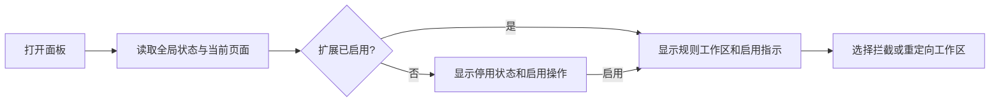

# Ajax Proxy V3 面板信息架构与关键流程

状态：阶段 4 的结构与流程设计稿。它指导后续 Vue 3 / PrimeVue 原型，不代表交互细节已经过用户验收，也不表示提案中的功能已经纳入 V3 范围。

## 设计目标

- 全局启用状态、当前处理页面和当前功能区一眼可见。
- 拦截规则与重定向规则是并列的规则工作区；V3 组合规则在拦截工作区中配置，不把一个请求拆到两个相互冲突的规则。
- 常用规则操作留在列表附近，复杂条件与 action 编辑放在有明确保存 / 取消出口的编辑视图。
- 导入、校验、覆盖确认和失败原因属于完整流程的一部分，不能只提供文件选择按钮。
- 简体中文和 English 是唯一目标语言；语言切换按计划保持常驻可见。

## 现状能力映射

以下“现有”均指当前 `packages/vue-panels` V2 面板源码中的能力。V3 不承诺复用 V2 配置或备份格式，表内说明的是用户任务迁移时应保留的产品能力。

| 当前能力                                            | 目标位置                 | 迁移要求                                                                    |
| --------------------------------------------------- | ------------------------ | --------------------------------------------------------------------------- |
| 全局启停、拦截 / 重定向模式切换                     | 应用顶栏                 | 启停状态持续可见；规则工作区切换与全局启停分开表达                          |
| 当前活动标签页标题                                  | 应用状态栏               | 作为当前页面上下文提示；标题为空或读取失败时不阻塞规则操作                  |
| 备份与恢复                                          | 顶栏工具区 / 数据菜单    | 恢复前校验格式和字段；展示失败路径；覆盖现有数据前确认                      |
| 语言下拉、GitHub 链接                               | 顶栏偏好区               | 语言改为“简体中文 / English”常驻双选；外链收纳到次级工具区                  |
| 拦截规则创建、编辑、复制、删除、单条启停            | 拦截工作区和规则行操作   | 创建 / 编辑共用表单；删除需确认；复制出的规则默认停用                       |
| URL / 备注搜索、标签筛选                            | 拦截工作区筛选栏         | 保留组合筛选语义；显示有效筛选条件，并提供明确清空和无结果状态              |
| method、匹配类型、响应状态码和 JSON / 函数 response | 组合规则编辑视图         | 请求条件与 response action 分区；字段错误就近显示；函数 action 显示风险说明 |
| 拦截命中计数                                        | 拦截工作区规则行         | 继续作为诊断计数呈现；不把计数误称为完整请求历史                            |
| 重定向规则创建、编辑、复制、删除、单条启停          | 重定向工作区和规则行操作 | 继续支持匹配类型、method、域名 / URL、请求头、排除项和函数目标配置          |

## 目标结构

```text
应用顶栏
├─ Ajax Proxy mark + 当前页面上下文
├─ 全局启用状态
├─ 拦截规则 / 重定向规则（并列工作区切换）
└─ 简体中文 / English + 备份 / 恢复 + 次级链接

规则工作区
├─ 标题、规则数量、创建规则
├─ 搜索 / 筛选（拦截区额外提供标签筛选）
├─ 规则列表
│  ├─ 启用状态、匹配条件、action 摘要、备注 / 标签、命中数
│  └─ 编辑、复制、删除
└─ 空列表 / 无搜索结果 / 读取或保存错误

规则编辑视图
├─ 请求匹配：URL 或域名、匹配方式、HTTP method
├─ 请求 action：重定向配置（按规则能力显示）
├─ 响应 action：响应替换配置（JSON / 受限函数）
├─ 可选备注、标签
└─ 校验结果、取消、保存
```

此结构是待原型验证的布局提案。现阶段不锁定使用整页、宽弹层或左右分栏；由 PrimeVue 原型比较可读性、键盘可达性和扩展面板尺寸后决定。

## 关键流程

### 启用与切换工作区



开关写入失败时保留上一次确认状态，并给出可读错误。当前页面标题读取失败时显示中性空值，不阻止开关或规则 CRUD。启用关闭后保留规则列表浏览和编辑入口，但清楚说明规则暂不作用于页面。

### 创建或编辑组合规则

1. 从工作区点击“创建规则”，或从规则行进入编辑；复制操作先创建一个默认停用的新规则。
2. 填写原始请求匹配条件：URL / 域名、匹配类型和 method。
3. 按需启用重定向 action、响应替换 action，或两者；每个 action 的输入区仅在启用时展开。
4. 填写备注 / 标签并执行 schema 校验；错误定位到具体字段，函数 action 展示风险与输入限制。
5. 保存成功后返回列表，更新规则行；保存失败时保留未提交输入并说明原因。取消或关闭时，只有存在未保存变更才询问是否放弃。

运行时以原始 URL / method 选择规则列表中的首条完整命中规则，且同一请求由该规则负责整个 request / response 生命周期；面板需在编辑说明中表达这一优先级，不暗示 action 会跨规则叠加。具体 V3 字段约束以 `docs/V3-RULE-MODEL.zh.md` 和 schema validator 为准。

### 搜索和筛选

- URL、备注搜索可与拦截标签筛选组合；匹配结果按稳定列表顺序显示。
- 有筛选且无命中时显示“没有符合条件的规则”与清除筛选操作；零规则时使用独立空态并提供创建入口。
- 搜索 / 筛选不得静默回退为全部规则；筛选条件应可见并能逐项移除。
- 排序、批量操作、未命中原因和请求历史属于阶段 5 评估项，不视为现有功能或本设计自动批准的新范围。

### 备份与恢复

1. 用户选择备份文件后，先解析 V3 格式并展示校验结果；不兼容的 V2 格式明确解释不支持，不自动迁移。
2. 若配置含用户函数代码，列明涉及规则并默认保持停用；用户必须明确启用后才允许执行。
3. 校验失败时列出 JSON 路径和原因，不覆盖当前配置；成功时展示将覆盖完整配置的确认步骤。
4. 确认后原子替换完整快照；成功显示规则数量和结果，存储失败则保留原配置并允许重试。

## 状态与可访问性要求

- 全局启用、当前工作区、规则启停和筛选状态均不能只靠颜色表达。
- 空列表、无搜索结果、加载失败、校验失败、保存失败和恢复成功分别设计状态文案与操作。
- 所有列表行操作和表单可用键盘到达；删除 / 覆盖确认对话框提供明确焦点返回位置。
- 小窗口下优先让匹配条件与 action 摘要可读，行操作收纳到明确的操作菜单；避免固定宽表格造成横向滚动成为唯一浏览方式。
- 颜色、字体和尺寸基线引用 `docs/V3-VISUAL-SYSTEM.zh.md` 与 `docs/V3-BRAND-DIRECTION.zh.md`；具体组件态、整页布局和真实扩展宽度仍需在 PrimeVue 原型后续阶段校准。

## 范围边界

| 状态           | 内容                                                                                                            |
| -------------- | --------------------------------------------------------------------------------------------------------------- |
| 迁移应保留     | 启停、两类规则 CRUD、复制、删除确认、拦截标签与搜索、method / matcher、响应和重定向配置、备份恢复任务、命中计数 |
| 本设计重新组织 | 并列工作区导航、状态栏、筛选条件可见性、空态 / 错误态、组合规则编辑结构、V3 恢复校验流程                        |
| 阶段 5 提案    | 排序、批量启停 / 导入导出、命中历史、未命中诊断、基于请求快捷建规则、分组和模板                                 |
| 明确不支持     | V2 配置 / 备份自动迁移；V3 使用独立 schema 和备份校验                                                           |

## 验收状态

- 现有关键能力已映射到目标结构，未把源码中不存在的功能伪装成现状。
- 启用、规则编辑、筛选和恢复流程描述了成功状态及错误回退。
- PrimeVue / Vue 3 实现、组件选择、具体布局与完整设计 token 仍待原型及视觉规范阶段决定。
